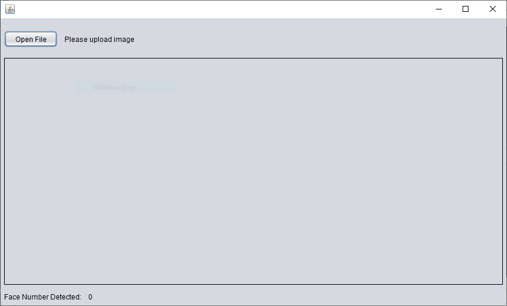
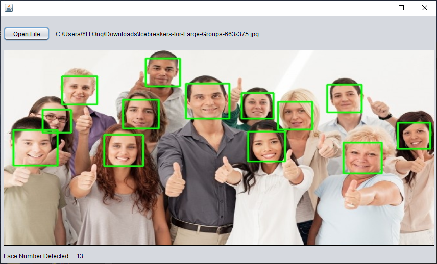

# Face Detection with GUI
User can count a number of people in the photo using face detection, 
once process completed it will display the number of faces detected.

## Prerequisites
Built in Java Environment and OpenCV
* [JDK 8](https://www.oracle.com/java/technologies/javase/javase-jdk8-downloads.html)
* [OpenCV 4.3.0](https://opencv.org/opencv-4-3-0/)

## Usage
This project developed by using NetBeans IDE.
* Before run the source code, you may run the compiler 
``` javac CountFaceDetection.java ```

* After compiled, you can run the sorce code
``` java CountFaceDetection ```

## Screenshot

<p align="center">
  
  
</p>
